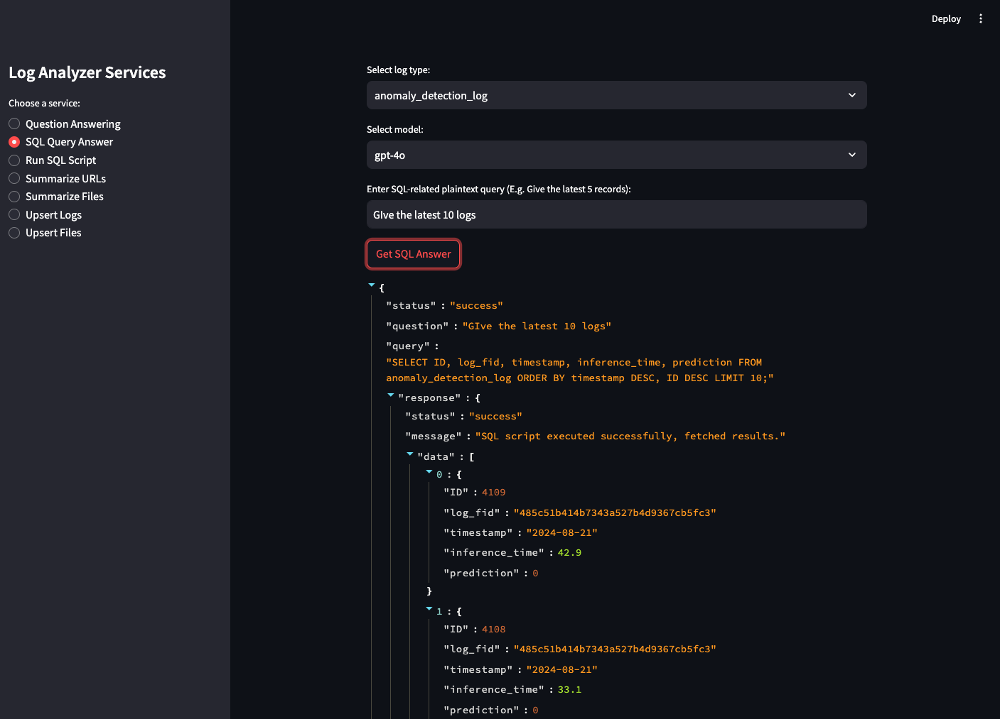

# Log Analyzer with LLMs and MySQL

[](https://app.codacy.com/gh/SamSamhuns/log_analyzer_with_llms_and_sql/dashboard?utm_source=gh&utm_medium=referral&utm_content=&utm_campaign=Badge_grade)

[](https://www.python.org/downloads/release/python-3100/)[](https://www.python.org/downloads/release/python-3110/)[](https://www.python.org/downloads/release/python-3120/)

- [Log Analyzer with LLMs and MySQL](#log-analyzer-with-llms-and-mysql)
  - [Architecture](#architecture)
  - [Setup](#setup)
    - [1. Create `.env` with `cp .env.example .env`](#1-create-env-with-cp-envexample-env)
    - [2. Create local volume dirs](#2-create-local-volume-dirs)
  - [Option A) Run with Docker Compose](#option-a-run-with-docker-compose)
  - [Option Bi) Run API Locally (without API container)](#option-bi-run-api-locally-without-api-container)
  - [Option Bii) Alternative uvicorn server with Docker](#option-bii-alternative-uvicorn-server-with-docker)
  - [Streamlit Frontend (optional)](#streamlit-frontend-optional)
  - [API Contract Notes](#api-contract-notes)
    - [`POST /qa`](#post-qa)
    - [`POST /sql/qa`](#post-sqlqa)
    - [`POST /sql/script`](#post-sqlscript)
  - [Testing](#testing)
    - [Optional: expose app through ngrok docker for sharing localhost on the internet](#optional-expose-app-through-ngrok-docker-for-sharing-localhost-on-the-internet)
  - [Developer Notes](#developer-notes)
  - [Reference](#reference)

Backend service for log analysis using FastAPI, LangChain, Chroma, and MariaDB.

## Architecture

[]()

- FastAPI API server (`app.server`)
- MariaDB for structured log storage
- Chroma for embedding/vector retrieval
- Optional Streamlit frontend (`app/streamlit_frontend.py`)

> [!NOTE]
> Instead of using the OpenAI api, the https://github.com/RayBytes/ChatMock project allows yout to use the ChatGPT web login and the web based api for free like Codex.

## Setup

### 1. Create `.env` with `cp .env.example .env`

```env
# API
# Set to ERROR for deployment
DEBUG=false
DEBUG_LEVEL=INFO
API_SERVER_PORT=8080
PROJECT_NAME=Log Analyzer API
PROJECT_DESCRIPTION=Log analysis with FastAPI, LangChain, and MariaDB.
API_VERSION=0.2.0
CORS_ALLOW_ORIGINS=http://localhost,http://127.0.0.1
CORS_ALLOW_CREDENTIALS=false

# OpenAI / LangChain
# alternative for openai api: https://github.com/RayBytes/ChatMock
# Add OPENAI_API_BASE=http://127.0.0.1:8000/v1 when using ChatMock
OPENAI_API_KEY=<OPENAI_API_KEY>
USER_AGENT=log_analyzer
LANGCHAIN_PROJECT=log_analyzer
LANGCHAIN_TRACING_V2=true
LANGCHAIN_ENDPOINT=https://api.smith.langchain.com
LANGCHAIN_API_KEY=<LANGCHAIN_API_KEY>

# SQL safety (keep false unless explicitly needed)
ALLOW_UNSAFE_SQL_SCRIPTS=false

# MariaDB
MYSQL_HOST=mysql
MYSQL_PORT=3306
MYSQL_USER=user
MYSQL_PASSWORD=pass
MYSQL_DATABASE=default
MYSQL_ROOT_PASSWORD=admin

# phpMyAdmin
PMA_GUI_PORT=8001
PMA_HOST=${MYSQL_HOST}
PMA_PORT=${MYSQL_PORT}
PMA_USER=${MYSQL_USER}
PMA_PASSWORD=${MYSQL_PASSWORD}
```

### 2. Create local volume dirs

```bash
mkdir -p volumes/log_analyzer
mkdir -p volumes/store
```

## Option A) Run with Docker Compose

```bash
docker compose build
docker compose up -d
```

API: <http://localhost:8080>

Optional phpMyAdmin profile:

```bash
docker compose --profile admin up -d mysql-admin
```

## Option Bi) Run API Locally (without API container)

Install requirements:

```shell
# With Poetry (Recommended)
poetry install --all-groups
```

```shell
# With venv / can also use conda environments
python -m venv venv; source venv/bin/activate
pip install -r requirements.txt
```

Start DB services:

```bash
docker compose up -d mysql
```

Run API:

```bash
# from isnide venv or with `poetry run`
uvicorn app.server:app --host 0.0.0.0 --port 8080 --reload
```

## Option Bii) Alternative uvicorn server with Docker

```bash
bash scripts/build_docker.sh
bash scripts/run_docker.sh -p 8080
```

## Streamlit Frontend (optional)

[]()

```bash
pip install streamlit==1.38.0
streamlit run app/streamlit_frontend.py
```

## API Contract Notes

### `POST /qa`

Request body:

```json
{
  "query": "What happened in the uploaded logs?"
}
```

Optional query param: `model=gpt-4o-mini`

### `POST /sql/qa`

Request body:

```json
{
  "log_type": "anomaly_detection_log",
  "question": "Give me the latest 5 records",
  "model": "gpt-4o-mini"
}
```

### `POST /sql/script`

Request body:

```json
{
  "query": "SELECT * FROM anomaly_detection_log LIMIT %s",
  "params": [10]
}
```

- Read-only SQL is enforced by default.
- Write SQL requires both:
  - `allow_write: true` in request body
  - `ALLOW_UNSAFE_SQL_SCRIPTS=true` on server

## Testing

```bash
poetry run pytest tests/
poetry run coverage run -m pytest tests/
poetry run coverage report -m -i
```

### Optional: expose app through ngrok docker for sharing localhost on the internet

WARNING: Never use for production

```bash
# start log analyzer with python
# sign up for ngrok account at https://ngrok.com/
# https://ngrok.com/docs/using-ngrok-with/docker/
docker pull ngrok/ngrok
# for linux systems
docker run --net=host -it -e NGROK_AUTHTOKEN=<NGROK_AUTHTOKEN> ngrok/ngrok:latest http <EXPOSED_HTTP_PORT>
# for MacOS and windows
docker run -it -e NGROK_AUTHTOKEN=<NGROK_AUTHTOKEN> ngrok/ngrok:latest http host.docker.internal:<EXPOSED_HTTP_PORT>
```


## Developer Notes

When adding a new log table schema, update:

- `app/static/sql/init.sql`
- `app/models/model.py` (`LogFileType`)
- `app/api/log_format/log_parser.py`
- `app/core/setup.py` (`TEXT2SQL_CFG_DICT` and prompt metadata)

## Reference

- [Text-to-SQL by LLMs: A Benchmark Evaluation](https://arxiv.org/pdf/2308.15363)
